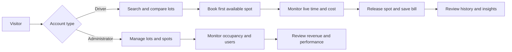
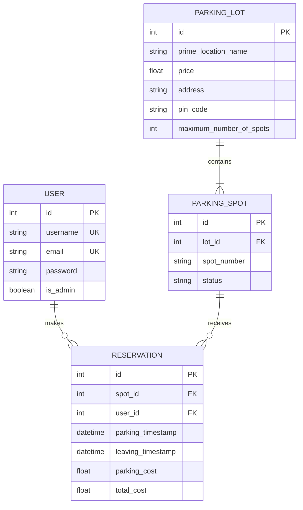

# Parkora

> **Find space. Save time.**

Parkora is a multi-user parking management platform that connects drivers with available parking and gives administrators a live view of their parking network. Drivers can discover the best lot, reserve an automatically allocated spot, monitor time and estimated cost, and review their parking history. Administrators can manage locations and capacity while tracking occupancy, users, and completed revenue.

## Preview

| Landing page | Smart lot finder |
| --- | --- |
|  |  |

| Driver dashboard | Operations dashboard |
| --- | --- |
|  |  |

> Keep the `docs/screenshots` folder in the repository. GitHub uses these relative paths to display the preview images.

## About Parkora 

- **Smart recommendations:** matching lots are ranked by availability percentage and then by hourly price, with the strongest option marked as the best match.
- **Live parking meter:** an active reservation shows its continuously updating duration and estimated cost.
- **Personal driver insights:** completed visits, total spend, average parking duration, and favorite location are calculated from real usage history.
- **Operations-focused analytics:** administrators see network occupancy, completed revenue, registered drivers, the busiest location, and per-lot performance.
- **Search that reflects real decisions:** drivers can search by location, address, or PIN code; administrators can quickly filter their lot table.
- **Integration-ready API:** the Flask blueprint exposes availability, reservations, and role-aware statistics as JSON.
- **Portfolio-ready engineering:** environment variables, reproducible demo data, privacy-conscious API responses, POST-based state changes, and automated workflow tests are included.

## Application flow

## Data model

## Technology stack

- **Backend:** Python, Flask, Flask-Login, Flask-WTF
- **Data layer:** SQLite, Flask-SQLAlchemy
- **Frontend:** Jinja, Bootstrap 5, custom CSS, Chart.js
- **Validation and security:** WTForms, Werkzeug password hashing, CSRF tokens
- **Quality:** Python `unittest`, isolated in-memory test database

## Project note

Parkora was developed from a multi-user parking-management brief and then expanded into a portfolio-ready product with a distinct brand, recommendation logic, live session tracking, personalized insights, operational analytics, a connected API, reproducible demo data, and automated tests.

