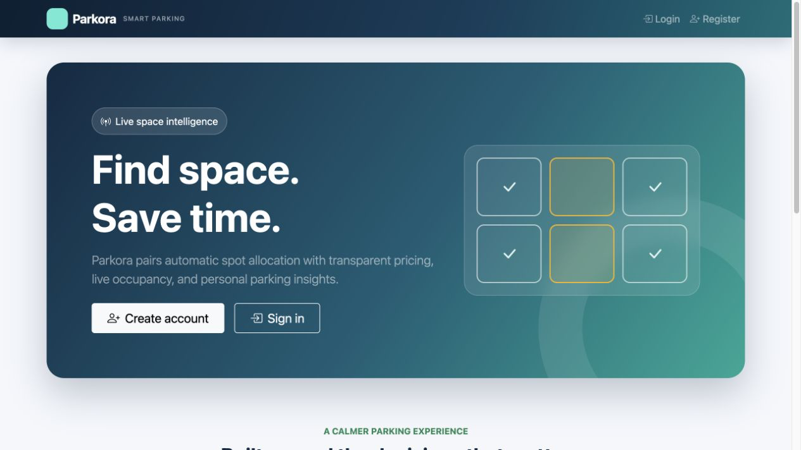
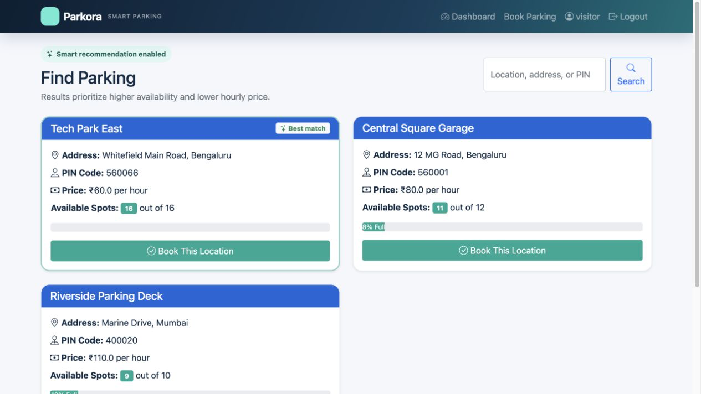
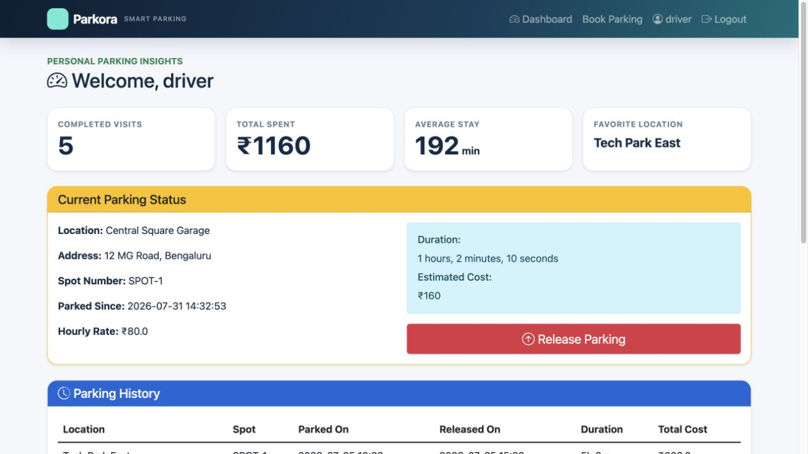
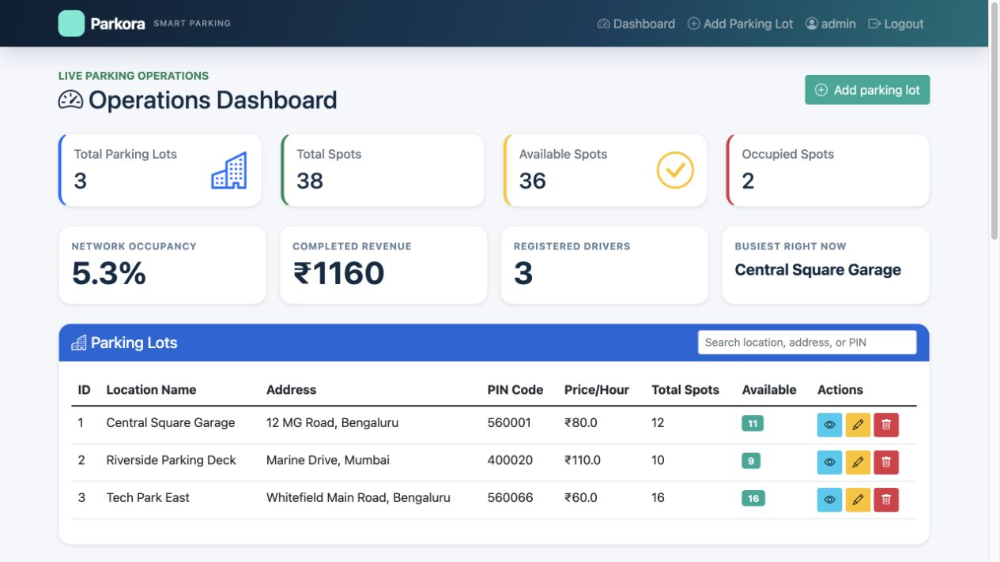
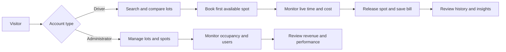
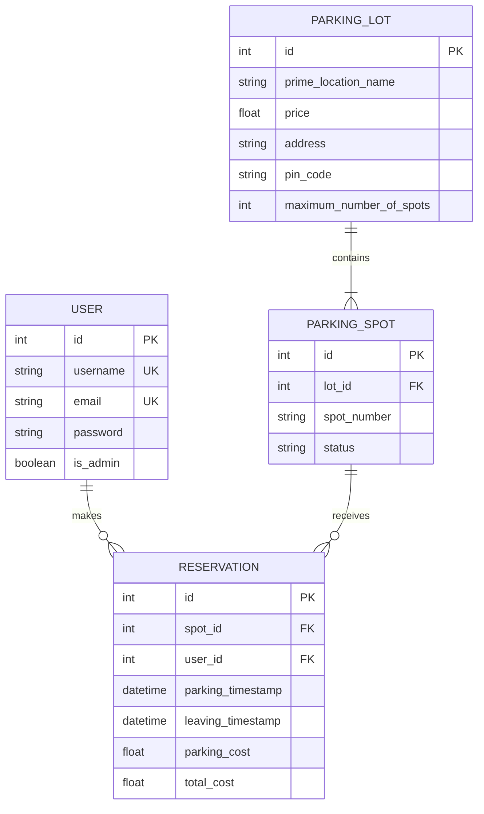

# Parkora

> **Find space. Save time.**

[](https://www.python.org/)
[](https://flask.palletsprojects.com/)
[](https://www.sqlite.org/)
[](#testing)

Parkora is a multi-user parking management platform that connects drivers with available parking and gives administrators a live view of their parking network. Drivers can discover the best lot, reserve an automatically allocated spot, monitor time and estimated cost, and review their parking history. Administrators can manage locations and capacity while tracking occupancy, users, and completed revenue.

## Preview

| Landing page | Smart lot finder |
| --- | --- |
|  |  |

| Driver dashboard | Operations dashboard |
| --- | --- |
|  |  |

> Keep the `docs/screenshots` folder in the repository. GitHub uses these relative paths to display the preview images.

## What makes Parkora different?

- **Smart recommendations:** matching lots are ranked by availability percentage and then by hourly price, with the strongest option marked as the best match.
- **Live parking meter:** an active reservation shows its continuously updating duration and estimated cost.
- **Personal driver insights:** completed visits, total spend, average parking duration, and favorite location are calculated from real usage history.
- **Operations-focused analytics:** administrators see network occupancy, completed revenue, registered drivers, the busiest location, and per-lot performance.
- **Search that reflects real decisions:** drivers can search by location, address, or PIN code; administrators can quickly filter their lot table.
- **Integration-ready API:** the Flask blueprint exposes availability, reservations, and role-aware statistics as JSON.
- **Portfolio-ready engineering:** environment variables, reproducible demo data, privacy-conscious API responses, POST-based state changes, and automated workflow tests are included.

## Features

### Driver experience

- Create an account and sign in securely.
- Search lots by name, address, or PIN code.
- Compare price, availability, and occupancy at a glance.
- Receive the first available spot automatically when booking.
- Maintain only one active reservation at a time.
- Track the active session with a live duration and cost estimate.
- Release the spot and calculate the final bill by rounded-up hours.
- Review completed parking history and personal insights.

### Administrator experience

- Use a protected administrator account created on first run.
- Create, edit, inspect, and delete parking lots.
- Add or safely reduce capacity while protecting occupied spots.
- Inspect each spot and the active reservation attached to it.
- Monitor network-wide availability and occupancy.
- Review registered drivers, completed revenue, and busiest location.
- Compare occupancy and revenue across locations.

### Platform foundations

- Role-based access with Flask-Login.
- Password hashing with Werkzeug.
- Validated Flask-WTF forms and CSRF protection.
- SQLite persistence through Flask-SQLAlchemy.
- Responsive Bootstrap interface with custom Parkora styling.
- JSON API endpoints for future mobile or external integrations.

## Application flow



## Data model



## Technology stack

- **Backend:** Python, Flask, Flask-Login, Flask-WTF
- **Data layer:** SQLite, Flask-SQLAlchemy
- **Frontend:** Jinja, Bootstrap 5, custom CSS, Chart.js
- **Validation and security:** WTForms, Werkzeug password hashing, CSRF tokens
- **Quality:** Python `unittest`, isolated in-memory test database

## Project structure

```text
Parkora/
├── app.py                 # Web routes and application setup
├── api.py                 # JSON API blueprint
├── config.py              # Environment-aware configuration
├── forms.py               # Validated forms
├── models.py              # SQLAlchemy data models
├── seed_demo.py           # Reproducible portfolio demo data
├── requirements.txt
├── .env.example
├── static/
│   ├── css/parkora.css
│   └── favicon.svg
├── templates/             # Jinja pages for both roles
├── tests/test_app.py      # End-to-end workflow tests
├── instance/.gitkeep      # Runtime database directory
└── docs/screenshots/      # Images displayed in this README
```

## Run locally

### 1. Create and activate a virtual environment

```bash
python -m venv .venv
```

macOS or Linux:

```bash
source .venv/bin/activate
```

Windows PowerShell:

```powershell
.venv\Scripts\Activate.ps1
```

### 2. Install the dependencies

```bash
pip install -r requirements.txt
```

### 3. Configure the application

```bash
cp .env.example .env
```

Windows users can copy `.env.example` to a new file named `.env` manually. Before deploying, replace the sample secret and administrator password in `.env`.

### 4. Start Parkora

```bash
python app.py
```

Open [http://127.0.0.1:5000](http://127.0.0.1:5000). The SQLite tables and administrator account are created automatically on first run.

## Portfolio demo data

To populate the dashboards with realistic lots, drivers, completed visits, and active reservations:

```bash
python seed_demo.py
python app.py
```

| Role | Username | Password |
| --- | --- | --- |
| Administrator | `admin` | `admin123` |
| Driver with history | `driver` | `driver123` |
| New driver | `visitor` | `visitor123` |

These are local demonstration credentials only. Change them before hosting the project publicly.

## Configuration

| Variable | Purpose | Local default |
| --- | --- | --- |
| `SECRET_KEY` | Signs sessions and CSRF tokens | Development-only value |
| `DATABASE_URL` | SQLAlchemy database connection | `sqlite:///parkora.db` |
| `FLASK_DEBUG` | Enables Flask debug mode | `True` |
| `ADMIN_USERNAME` | Initial administrator username | `admin` |
| `ADMIN_EMAIL` | Initial administrator email | `admin@parkora.local` |
| `ADMIN_PASSWORD` | Initial administrator password | `admin123` |

## API overview

All endpoints are prefixed with `/api`.

| Method | Endpoint | Access | Purpose |
| --- | --- | --- | --- |
| `GET` | `/parking-lots` | Public | List lots and live availability |
| `GET` | `/parking-lots/<lot_id>` | Public | Inspect a lot and its spot states |
| `POST` | `/parking-lots` | Administrator | Create a lot and its spots |
| `GET` | `/reservations/current` | Driver | Return the active reservation |
| `POST` | `/reservations/book/<lot_id>` | Driver | Book the first available spot |
| `POST` | `/reservations/release` | Driver | Release a spot and calculate cost |
| `GET` | `/stats/overview` | Administrator | Return network operating metrics |
| `GET` | `/stats/user` | Signed-in user | Return personal parking statistics |

Browser-based API actions use the same authenticated session as the web application.

## Testing

Run the automated workflow suite from the project root:

```bash
python -m unittest discover -s tests -v
```

The tests use an isolated in-memory database and cover public access, login, administrator pages, search ranking, API availability, first-spot allocation, release, and billing.

## Future improvements

- Add payment-gateway integration and downloadable receipts.
- Introduce advance reservations and cancellation rules.
- Add map-based discovery and distance-aware recommendations.
- Send parking confirmations and expiry reminders.
- Move production deployments to PostgreSQL with migration support.
- Add accessibility and browser automation checks to continuous integration.

## Project note

Parkora was developed from a multi-user parking-management brief and then expanded into a portfolio-ready product with a distinct brand, recommendation logic, live session tracking, personalized insights, operational analytics, a connected API, reproducible demo data, and automated tests.

